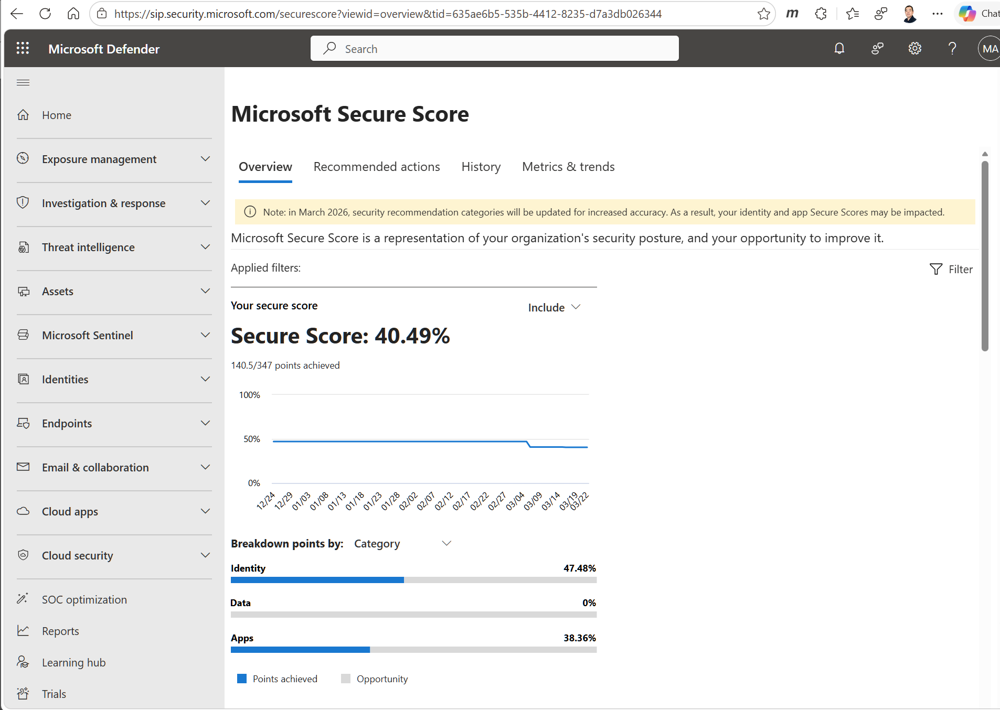
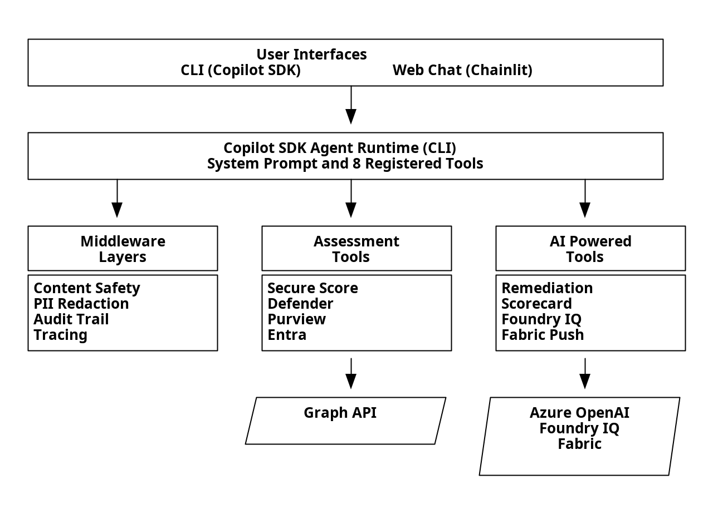
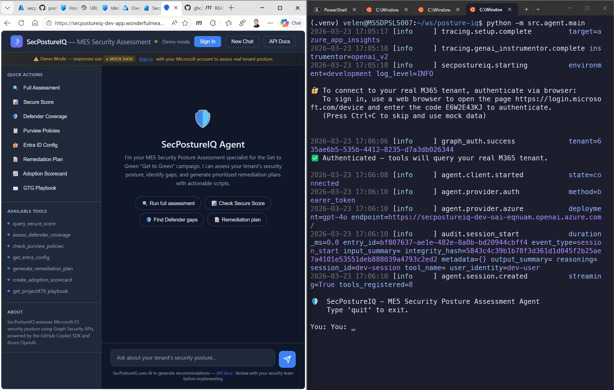
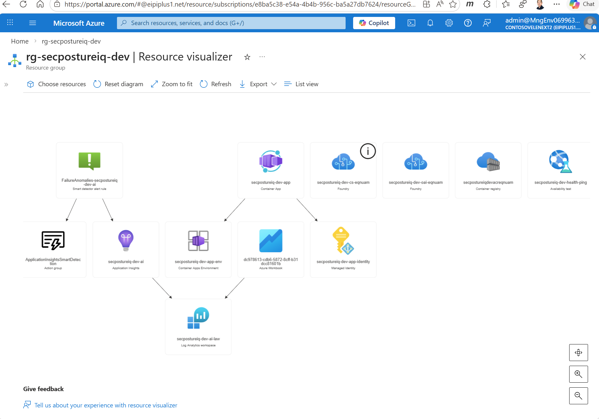

# SecPostureIQ: Assessing M365 Security Posture in Minutes with GitHub Copilot SDK

*By [Velen Liang](https://www.linkedin.com/in/velenliang) and [Ying-Jung Chen](https://www.linkedin.com/in/yj-elizabeth-chen/)*

---

## Why We Built This

Four portals. Twelve sub-pages. One hour just to collect raw data — before writing a single recommendation.

That's the reality of assessing a customer's Microsoft 365 E5 security posture today. Account teams running Microsoft's "Project 479 — Get to Green" campaign need to evaluate coverage across Defender, Purview, Entra ID, and Secure Score for every tenant they manage. The process takes one to two weeks per assessment and involves manually navigating admin portals, cross-referencing configurations, and compiling findings into spreadsheets.

The bottleneck isn't the product. It's the *assessment*. Internal telemetry shows over 400,000 tenants in the E5 family — many purchased premium security licensing years ago but never fully activated it. The manual approach never could have scaled.

We built SecPostureIQ to compress that into a three-minute conversation.



## What We Built

SecPostureIQ is an agentic assistant built on the [GitHub Copilot SDK](https://github.com/github/copilot-sdk) that assesses a tenant's ME5 security posture in minutes. It connects to Microsoft Graph Security APIs, evaluates coverage across four workloads (Defender, Purview, Entra ID, Secure Score), and generates a prioritized remediation plan with executable PowerShell scripts.

The agent doesn't follow a fixed script. It reasons across eight specialized tools and autonomously decides the execution order based on what it finds — if Defender coverage is strong but Purview is absent, it focuses remediation on information protection gaps.

| Metric | Manual (before) | SecPostureIQ (after) |
|--------|-----------------|----------------------|
| Time to assess one tenant | 1–2 weeks | Under 3 minutes |
| Portals visited | 4 portals, 12+ sub-pages | 0 — one conversation |
| Output format | Word doc / spreadsheet | Scorecard + executable scripts |

## How It Works



### The role of the Copilot SDK

The Copilot SDK is a thin client — the real orchestration happens in the Agent Runtime (the Copilot CLI binary), which the SDK spawns as a child process and communicates with via JSON-RPC over stdin/stdout. We register eight tools and a system prompt encoding our assessment methodology. The runtime handles the rest: deciding execution order, managing context across tool calls, and synthesizing results.

We didn't build a planner, a tool loop, or a context manager. The SDK is the steering wheel; the Agent Runtime is the engine.

### Eight tools, two interfaces

Each tool wraps Graph Security API calls or Azure services. Four *assessment* tools collect data (Secure Score, Defender coverage, Purview policies, Entra config). Four *AI-powered* tools generate outputs (remediation plans with PowerShell scripts, adoption scorecards, Foundry IQ playbooks, and Fabric lakehouse snapshots). Four middleware layers — Content Safety, PII redaction, OpenTelemetry tracing, and audit logging — wrap every request.

The same tools and system prompt power both the CLI (for developers) and a Chainlit web UI (for account teams). Add a tool once, it appears in both interfaces.

### A full assessment in action

When an account team member types *"Run a full assessment"*, the agent autonomously chains tool calls: retrieves Secure Score (40.49%), discovers Defender for Endpoint has zero onboarded devices, finds no active DLP policies, identifies Conditional Access policies stuck in report-only mode — then synthesizes everything into a prioritized remediation plan (P0–P2) with copy-paste PowerShell scripts and a red/yellow/green adoption scorecard. The entire sequence completes in under three minutes.



## What Makes This Powerful

**Why SDK over raw function calling?** Function calling gives you tool dispatch — you still build the planner, retry logic, context compaction, streaming, and session lifecycle. The SDK gives you the complete agent runtime. We register tools and the runtime decides when to call them, in what order, and how to synthesize results. Building a car versus building an engine.

**SDK lessons learned.** Packaging the CLI binary into Docker for Azure Container Apps required a multi-stage Dockerfile with explicit `gh` installation — not documented in the getting-started guide. We also had to add output validation after GPT-4o hallucinated base64-encoded PNG images instead of text emoji for status badges.

**Enterprise-grade safety.** All eight Graph API permissions are read-only — the agent never modifies a customer's tenant. PII redaction strips tenant GUIDs, emails, and IP addresses before data reaches Azure OpenAI. Content Safety blocks prompt injection attempts. We validated this against a live M365 E5 tenant with 1,236 tests (80% coverage gate in CI).

**Graph API least-privilege.** Five read-only permissions across eight endpoints, with specific handling for PIM (which returns 403 for app tokens by design, requiring delegated-only access).

## Demo & Artifacts

SecPostureIQ works out of the box with mock data — no Azure subscription or M365 tenant required:

```bash
git clone https://github.com/9owlsboston/posture-iq.git
cd posture-iq
python3.11 -m venv .venv && source .venv/bin/activate
pip install -r requirements.lock && pip install -e ".[dev]"
python -m uvicorn src.api.app:app --host 0.0.0.0 --port 8000
# Open http://localhost:8000 → Try: "What is our Secure Score?"
```

To assess a real M365 E5 tenant, see the [Setup Guide](https://github.com/9owlsboston/posture-iq/blob/main/SETUP.md).

[Explore the repo on GitHub →](https://github.com/9owlsboston/posture-iq)



---

## About the authors

**[Velen Liang](https://www.linkedin.com/in/velenliang)** is a Cloud & AI Platform Solution Architect at Microsoft. He designed SecPostureIQ's architecture, Azure deployment pipeline, and enterprise security layers.

**[Ying-Jung Chen](https://www.linkedin.com/in/yj-elizabeth-chen/)** is an AI Agent Researcher at Microsoft with a PhD in Computer Science from UC Santa Barbara. She built SecPostureIQ's agentic reasoning layer, tool orchestration, and evaluation framework.
